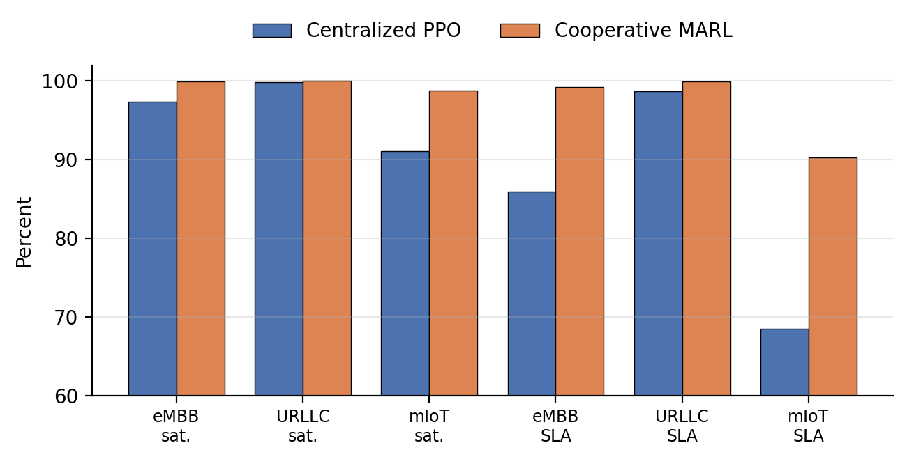
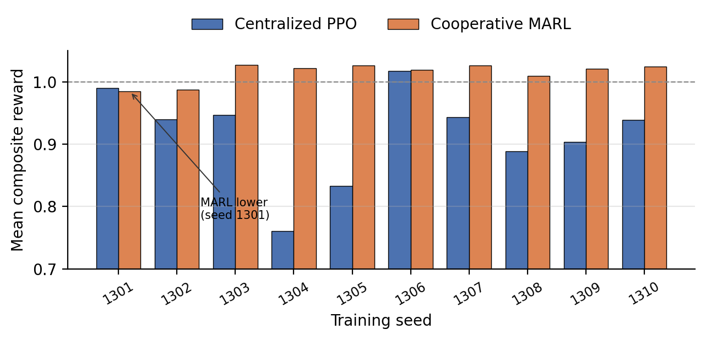

# Introduction

Network slicing lets a single radio-access network (RAN) present logically isolated services with sharply different objectives on shared physical resources. Enhanced mobile broadband (eMBB) is rewarded for sustained downlink throughput; ultra-reliable low-latency communication (URLLC) requires strong reliability and latency protection at low offered load; and massive machine-type communication (mIoT/eMTC) must serve large, bursty device populations at low per-device rate. A slice-allocation controller must divide a physical-resource-block (PRB) budget among these services every control interval so that each service's service-level agreement (SLA) is respected where feasible, while keeping the shared resource well used and the allocation stable enough not to disturb schedulers and link adaptation downstream.

A *centralized* controller conditions one joint action on the full multi-slice state. This is expressive: cross-slice trade-offs are represented directly, and there is a single value function to learn. But the joint action space and the credit-assignment burden grow as the number of controlled decisions increases, and a single learner must discover the whole coupling structure from scratch within a finite interaction budget. A *cooperative multi-agent* controller instead factorizes action selection into slice-local policies that share a common objective, and enforces feasibility through an explicit coordination step. The factorization is a structural prior: it encodes the assumption that slices are a natural decision axis, which -- if correct -- reduces what each learner must fit.

The question tested in this paper is deliberately narrow: *under matched synthetic traffic and matched PPO training budgets, does a three-agent slice-local formulation improve the disclosed composite reward over a centralized PPO controller in a bounded PRB-share environment?* We answer it with paired evaluation, training-seed-level uncertainty quantification, SLA guardrails, and explicit scope limits.

**Contributions.** (i) A matched, paired comparison of centralized PPO and cooperative MARL for SLA-protected slice allocation, holding traffic, reward, PPO settings, and interaction count fixed. (ii) A training-seed-clustered bootstrap that separates training-initialization variance from held-out traffic variance, with a predefined publication gate. (iii) A per-seed disclosure of the reward difference, including the one seed where MARL does not win and the two seeds that contribute the largest gains. (iv) An explicit statement of what the result does and does not license, and a defined next experiment inside the full multi-tier twin.

This work is a companion to the Multi-Tier 6G RAN Digital Twin v6 paper [@twin_v6] and its method note [@twin_method]. It does not replace the full twin's propagation, mobility, association, handover, interference, non-terrestrial, or steering evaluation; it isolates one sub-problem to test one architectural hypothesis cheaply.

# Related Work

**Cooperative MARL.** Centralized-training / decentralized-execution methods such as MADDPG [@lowe2017maddpg] and counterfactual multi-agent policy gradients (COMA) [@foerster2018coma] address the non-stationarity and credit-assignment problems that arise when several agents learn against a shared reward. Independent learners -- independent PPO (IPPO) and independent Q-learning -- drop the centralized critic entirely and are simpler, but each agent then treats the others' evolving policies as part of a non-stationary environment. The controller studied here is closest to IPPO with a *shared* cooperative reward and a deterministic feasibility projection standing in for explicit coordination; it is decentralized action selection with shared task-level feedback, not three independent objectives.

**RL for RAN slicing.** Reinforcement learning has been applied to slice admission, inter-slice PRB partitioning, and joint slice/scheduling control, typically with a single centralized agent. Multi-agent formulations have been proposed for multi-cell or multi-slice settings, but matched, paired comparisons against a centralized baseline -- with the traffic generator, reward, and interaction budget held fixed and with seed-level uncertainty reported -- remain uncommon. This paper is a small step toward that kind of controlled comparison.

**PPO.** Both controllers use PPO [@schulman2017ppo] with a clipped surrogate objective and generalized advantage estimation (GAE) [@schulman2016gae]. PPO is chosen because its on-policy update and clipping make the two architectures comparable when the number of environment interactions is held equal.

# Slice-Allocation Environment

The environment isolates inter-slice PRB-share coordination for a single cell. Each control step the controller outputs a share vector $\pi_t = (\pi_{e}, \pi_{u}, \pi_{m})$ over eMBB, URLLC, and mIoT/eMTC with $\sum_s \pi_s = 1$. A fixed feasible PRB budget is split according to $\pi_t$; per-slice served rate is the smaller of offered demand and the capacity implied by the allocated PRBs and that slice's spectral-efficiency indicator, and per-slice satisfaction $\sigma_s \in [0,1]$ is served divided by offered (with $\sigma_s = 1$ when there is no offered demand in the interval).

**Traffic.** Offered load per slice follows synthetic trace profiles (balanced busy hour, eMBB hotspot, URLLC burst, massive-IoT wave, mixed-failure stress), each normalized to its own peak, with a small autoregressive residual so repeated passes over a short trace still vary. Training and evaluation use disjoint traffic seeds.

**Episodes.** Each training seed runs 260 episodes of 48 Markov-decision-process steps, i.e. 12,480 environment interactions. The same budget is used for both architectures.

**Common objective.** Both controllers optimize the same per-step reward
$$
r = 0.35\,\sigma_e + 0.45\,\sigma_u + 0.20\,\sigma_m
- \mathbf{k}^{\top}[\boldsymbol{\theta} - \boldsymbol{\sigma}]_{+}
+ 0.05\,U
- 0.025\,\lVert \pi_t - \pi_{t-1} \rVert_1 ,
$$
where $\boldsymbol{\sigma} = (\sigma_e, \sigma_u, \sigma_m)$ is the slice-satisfaction vector, $U$ is PRB utilization, $\pi_t$ is the current allocation, $[\,\cdot\,]_{+}$ is the elementwise positive part, $\boldsymbol{\theta} = (0.95, 0.999, 0.99)$ are the per-slice SLA satisfaction targets, and $\mathbf{k} = (0.70, 1.30, 0.80)$ are the per-slice SLA-deficit penalty weights. Fairness is deliberately excluded; explicit SLA deficits, not a fairness term, protect the services. The last term penalizes allocation churn. Reward can exceed one because the utilization term contributes up to $0.05$; it is therefore neither a probability nor a normalized percentage.

# Control Formulations

## Centralized PPO

The centralized controller is one PPO actor--critic with a 13-input observation and two 64-unit hidden layers. The observation concatenates eMBB, URLLC, and mIoT/eMTC demand-to-capacity indicators, channel-efficiency indicators, the previous allocation, aggregate offered load, resource availability, and an episode-phase feature. The action selects one feasible joint PRB-share template from a small discrete set. Because the full joint observation is available to a single learner, cross-slice trade-offs can be represented directly in one value function.

## Cooperative MARL

The MARL controller is three independent PPO actor--critics, one per slice, each with a 7-input observation and two 64-unit hidden layers. A slice-local observation includes that slice's demand-to-capacity need, its spectral-efficiency indicator, its previous share, the broadcast aggregate offered load, resource availability, and the episode-phase feature. Each agent emits an allocation bid for its own slice. A deterministic coordinator then projects the three bids onto the shared PRB budget and the minimum slice shares $(0.25, 0.20, 0.10)$ for eMBB, URLLC, and mIoT/eMTC: it clips each bid to its floor, then renormalizes the residual budget in proportion to the bids above floor so that the resulting share vector is feasible and sums to one. All three agents receive the *same* cooperative reward of (1). This is decentralized action selection with shared task-level feedback, not three independent objectives.

## Why the decomposition might, or might not, help

The factorization removes the joint template selection: each agent chooses only its own slice's bid, so the per-agent action space and the per-agent credit-assignment problem are smaller. Against that, three agents learning simultaneously against a shared reward each face a non-stationary environment -- the other two agents' policies keep changing -- which independent learning does not correct for. The deterministic coordinator also carries real weight: it, not the agents, guarantees feasibility and the minimum shares, so part of any measured advantage is a property of the projection rule rather than of the learned policies. These considerations motivate reporting per-seed results and a clustered interval rather than a single aggregate number.

# Matched Experimental Method

Both controllers use PPO clipping $\epsilon = 0.2$, discount $\gamma = 0.97$, GAE, identical synthetic traffic traces, the same feasible PRB budget, and equal environment-interaction counts (12,480 per training seed, from 260 episodes of 48 steps). Ten independent training initializations (seeds 1301--1310) are used per architecture.

**Paired evaluation.** Every trained centralized--MARL pair is evaluated on the *same* 40 unseen traffic seeds, giving $10 \times 40 = 400$ paired evaluation cases. Pairing removes traffic-trace variance from the comparison: for each held-out seed, the centralized and MARL controllers see identical offered load.

**Uncertainty.** The unit of training replication is the *training seed*, not the held-out replay. The 40 evaluations attached to one trained pair are not 40 independent training replications -- they measure traffic generalization of that one pair. The confidence interval therefore resamples training-seed *clusters* with replacement (each resample draws 10 training seeds with replacement and keeps all 40 paired evaluations for each drawn seed), and reports the 2.5th and 97.5th percentiles of the resampled mean reward difference.

**Predefined publication gate.** The result is presented only if (i) the training-seed-clustered 95% interval for the mean reward difference is wholly positive, and (ii) no slice shows an interval-SLA-compliance regression larger than 0.5 percentage point. Both conditions were fixed before the sweep was run.

# Results

## Aggregate

Table I reports the matched aggregate results over the 400 paired evaluations. The MARL controller improves mean composite reward by 0.0985, or 10.75% relative to centralized PPO. The training-seed-clustered 95% interval for the absolute difference is $[0.0535, 0.1480]$ -- wholly positive, so gate (i) is met. Modeled interval-SLA compliance improves for all three slices, most strongly for mIoT/eMTC (+21.82 pp), so gate (ii) is met with no regression. Fig. 1 shows the per-slice satisfaction and SLA-compliance bars.

| Metric | Centralized PPO | MARL | MARL $-$ centralized |
|---|---:|---:|---:|
| Composite reward | 0.9162 | 1.0147 | $+0.0985$ |
| eMBB mean satisfaction | 97.40% | 99.90% | $+2.50$ pp |
| URLLC mean satisfaction | 99.85% | 99.99% | $+0.15$ pp |
| mIoT/eMTC mean satisfaction | 91.10% | 98.74% | $+7.65$ pp |
| eMBB interval SLA compliance | 85.94% | 99.23% | $+13.29$ pp |
| URLLC interval SLA compliance | 98.70% | 99.93% | $+1.23$ pp |
| mIoT/eMTC interval SLA compliance | 68.49% | 90.31% | $+21.82$ pp |
| Resource utilization | 59.13% | 57.87% | $-1.25$ pp |
| Allocation churn (lower is better) | 0.0999 | 0.0693 | $-0.0306$ |

: Matched centralized-PPO and MARL comparison across 400 paired evaluations. Percentage-point differences are denoted pp.

{#fig-slice width=100%}

## Training-seed robustness

Table II and Fig. 2 give the mean reward by trained pair. The MARL controller is higher in 9 of 10 training seeds. Seed 1301 is the single exception, with a difference of $-0.0052$. Seeds 1304 and 1305 contribute the largest gains ($+0.2610$ and $+0.1928$); in both, the centralized controller trained to a comparatively low reward (0.7609 and 0.8331), while the MARL controller reached the same $\approx 1.02$ level it reaches on almost every seed. This concentration is why the clustered interval -- which can resample those two seeds in or out -- is wide, and why per-seed disclosure matters.

| Seed | Centralized | MARL | Difference |
|---|---:|---:|---:|
| 1301 | 0.9899 | 0.9847 | $-0.0052$ |
| 1302 | 0.9394 | 0.9874 | $+0.0481$ |
| 1303 | 0.9469 | 1.0269 | $+0.0800$ |
| 1304 | 0.7609 | 1.0218 | $+0.2610$ |
| 1305 | 0.8331 | 1.0258 | $+0.1928$ |
| 1306 | 1.0176 | 1.0189 | $+0.0013$ |
| 1307 | 0.9433 | 1.0263 | $+0.0831$ |
| 1308 | 0.8885 | 1.0093 | $+0.1208$ |
| 1309 | 0.9036 | 1.0210 | $+0.1174$ |
| 1310 | 0.9391 | 1.0247 | $+0.0856$ |

: Mean composite reward by training seed.

{#fig-seed width=100%}

## The utilization--SLA trade-off

The MARL controller uses 1.25 percentage points less of the available PRB budget (57.87% versus 59.13%) and yet raises satisfaction and SLA compliance on every slice. The disclosed reward of (1) prefers the higher SLA satisfaction and the lower churn (allocation churn falls by 0.0306) over the utilization it gives up. This is a direct consequence of the reward weights: the utilization term contributes at most 0.05, while an unmet SLA target on URLLC or mIoT/eMTC is penalized at $\mathbf{k}$ of 1.30 and 0.80. The result should therefore not be read as a raw resource-efficiency improvement -- it is a re-weighting of a fixed budget toward the services the reward protects.

# Interpretation

The result supports a conditional engineering conclusion: *in this bounded environment, factorizing action selection by slice while coordinating feasibility improves the disclosed reward at the tested training budget.*

The largest SLA gain is on mIoT/eMTC. The centralized controller selects one joint template per step from a small discrete set; when demand across the three slices does not match any template well, the residual unmet demand tends to land on the lowest-weight slice, which is mIoT/eMTC. The per-slice agents, with a continuous bid and a renormalizing coordinator, can track that slice's need more finely. The churn reduction points the same way: local policies plus a deterministic projection produce allocations that move less between steps than joint template switching does.

The gate is passed because the clustered reward interval is positive and no slice regresses on SLA compliance. The gate governs whether the result is presented; it does not establish universal MARL superiority. The advantage remains conditional on the discrete action parameterization of the centralized controller, the traffic generator, the slice-local observation design, the coordinator rule, the reward weights, and the finite 12,480-interaction budget. A centralized controller with a continuous action head, or a larger training budget, might close part of the gap.

# Threats to Validity

**Model validity.** The traffic profiles, channel-efficiency indicators, and SLA outcomes are synthetic and have not been calibrated against carrier measurements. Nothing here is evidence of field performance or of 3GPP / O-RAN [@oran_arch] conformance.

**Scope validity.** The environment isolates single-cell PRB-share coordination. It omits the companion twin's six-tier propagation, mobility, association, A3/A5 handover, explicit inter-cell interference, non-terrestrial dynamics, and multi-access steering. The gain therefore cannot be cited as an end-to-end six-tier MARL result.

**Algorithmic validity.** The centralized and multi-agent parameterizations are structurally different: a 13-input joint learner with a discrete template action versus three 7-input learners with continuous bids and a projection. Matching hidden width, PPO settings, and interaction count improves comparability but does not equalize representational capacity or optimization difficulty. Hyperparameter sweeps and compute-normalized comparisons remain future work.

**Statistical validity.** Ten training seeds provide useful replication but remain modest, and two of them (1304, 1305) contribute a disproportionate share of the mean gain. The 40 evaluation traces per trained pair measure traffic generalization, not training replication; clustered resampling addresses that dependence, but more training seeds would narrow the interval and test sensitivity to the two large-gain seeds. A per-seed paired test corroborates the direction (9 of 10 positive) but is not a substitute for more seeds.

# Relationship to the v6 Twin Paper and Next Steps

The Multi-Tier 6G RAN Digital Twin v6 paper [@twin_v6] retains its centralized branching PPO / Double-DQN controller for end-to-end experiments. This paper is a separately bounded motivation for implementing three per-slice agents inside that simulator. The defined next experiment is to integrate the cooperative MARL controller into the full twin -- with the twin's own propagation, mobility, handover, interference, traffic, and control-interval budget -- and repeat the paired, training-seed-clustered evaluation there. Only that experiment can say whether the decomposition advantage measured here survives the couplings the bounded environment removes.

# Conclusion

Under matched synthetic conditions, cooperative multi-agent reinforcement learning improves mean composite reward from 0.9162 to 1.0147 ($+10.75$%) relative to a centralized PPO controller for SLA-protected RAN slice allocation, with a wholly positive training-seed-clustered 95% interval of $[0.0535, 0.1480]$ and gains in modeled interval-SLA compliance for all three slices. The MARL controller also reduces allocation churn but uses 1.25 percentage points less of the available PRB budget, so the improvement is a reward-weighted re-prioritization rather than a uniform gain. These results justify integrating a per-slice MARL controller into the full multi-tier twin and repeating the evaluation there; they do not justify a blanket claim that MARL is superior in deployed or end-to-end multi-tier RAN systems.
