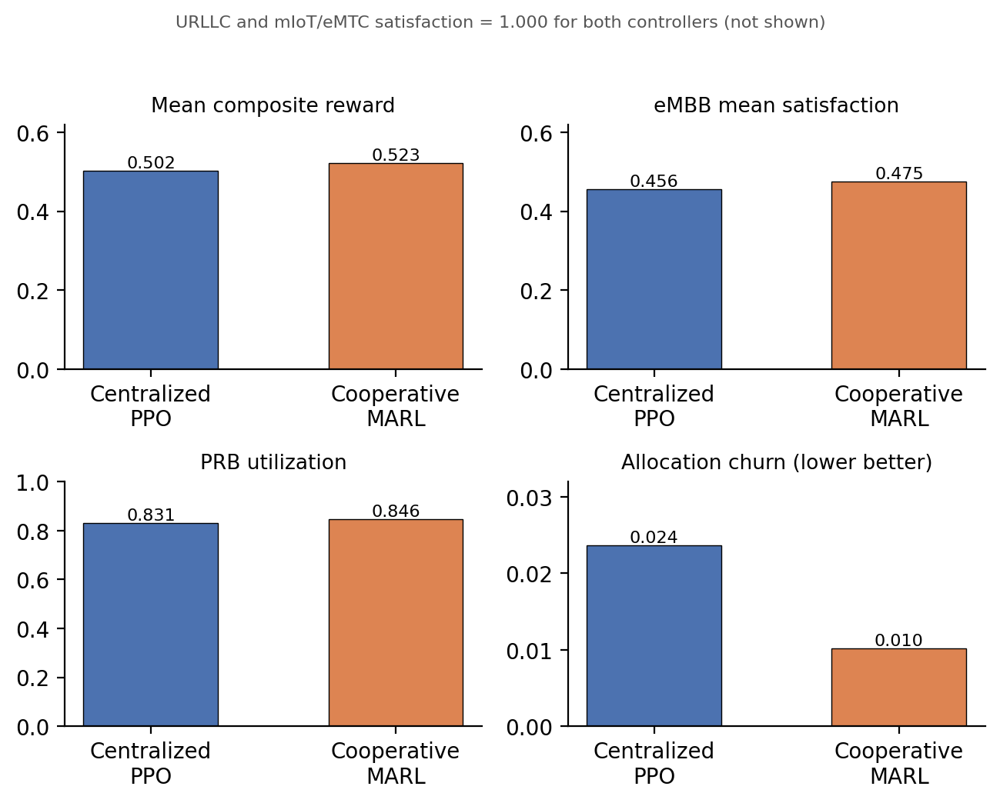
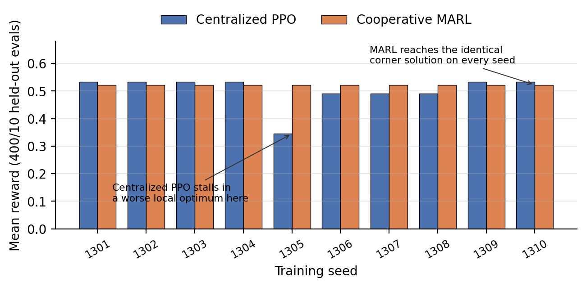

# Introduction

Network slicing lets a single radio-access network (RAN) present logically isolated services with sharply different objectives on shared physical resources. Enhanced mobile broadband (eMBB) is rewarded for sustained downlink throughput; ultra-reliable low-latency communication (URLLC) requires strong reliability and latency protection at low offered load; and massive machine-type communication (mIoT/eMTC) must serve large, bursty device populations at low per-device rate. A slice-allocation controller must divide a physical-resource-block (PRB) budget among these services every control interval so that each service's service-level agreement (SLA) is respected where feasible, while keeping the shared resource well used and the allocation stable.

A *centralized* controller conditions one joint action on the full multi-slice state: expressive, with a single value function to learn, but with a joint action space and credit-assignment burden that grow with the number of controlled decisions. A *cooperative multi-agent* controller factorizes action selection into slice-local policies that share a common objective, enforcing feasibility through an explicit coordination step -- a structural prior that, if the slice decomposition is a good one, reduces what each learner must fit.

The question tested here is narrow and empirical, not rhetorical: *under matched synthetic traffic, matched PPO training budgets, and a shared reward, does a three-agent slice-local formulation produce a genuine, seed-robust reward advantage over a centralized PPO controller -- and if an aggregate advantage appears, does it reflect richer adaptive control or something else?* The second half of that question turns out to matter as much as the first.

**Contributions.** (i) A matched, paired comparison of centralized PPO and cooperative MARL for SLA-protected slice allocation, with both controllers built from the same underlying PPO actor--critic implementation, holding traffic, reward, PPO settings, and interaction count fixed. (ii) A training-seed-clustered bootstrap that separates training-initialization variance from held-out traffic variance, reported alongside the raw per-seed results rather than instead of them. (iii) A mechanistic account of *why* the two architectures differ on the tested profile -- a corner-solution / training-reliability effect, not an adaptive-coordination effect -- obtained by inspecting the actual per-slice demand-to-capacity ratios the environment produces. (iv) A fully released reference implementation, so every number in this paper can be regenerated from the repository rather than taken on faith.

This work isolates one sub-problem of a larger multi-tier 6G RAN digital twin to test one architectural hypothesis cheaply. It does not replace the full twin's propagation, mobility, association, handover, interference, non-terrestrial, or multi-access-steering evaluation.

# Related Work

**Cooperative MARL.** Centralized-training / decentralized-execution methods such as MADDPG [@lowe2017maddpg] and counterfactual multi-agent policy gradients (COMA) [@foerster2018coma] address the non-stationarity and credit-assignment problems that arise when several agents learn against a shared reward. Independent learners -- independent PPO (IPPO) and independent Q-learning -- drop the centralized critic entirely and are simpler, but each agent then treats the others' evolving policies as part of a non-stationary environment. The controller studied here is closest to IPPO with a *shared* cooperative reward and a deterministic feasibility projection standing in for explicit coordination; it is decentralized action selection with shared task-level feedback, not three independent objectives.

**RL for RAN slicing.** Reinforcement learning has been applied to slice admission, inter-slice PRB partitioning, and joint slice/scheduling control, most often with a single centralized agent; DORA, for example, uses a PPO agent to allocate PRBs across URLLC, eMBB, and mMTC slices under fluctuating load [@dora2025]. Multi-agent formulations have been proposed for O-RAN and multi-cell settings -- constrained MARL that scales with the number of slices [@jsac2023flexible], coordinated multi-agent DRL for inter-cell slicing resource partitioning [@intercell2022coordinated], and attention-based multi-agent PPO for latency-spike resolution in 6G RAN slicing [@attn2026mappo]. What this paper adds is not another positive result in that line, but a matched, seed-robust test of whether a positive aggregate effect, where one appears, actually reflects the architectural advantage usually claimed for it.

**PPO.** Both controllers use PPO [@schulman2017ppo] with a clipped surrogate objective and generalized advantage estimation (GAE, $\lambda=0.95$) [@schulman2016gae]. PPO is chosen because its on-policy update and clipping make the two architectures comparable when the number of environment interactions is held equal.

# Slice-Allocation Environment

The environment isolates inter-slice PRB-share coordination for a single cell, and reuses this project's existing traffic and capacity model (`engine.py`) unmodified. Each control step the controller outputs a share vector $\pi_t = (\pi_{e}, \pi_{u}, \pi_{m})$ over eMBB, URLLC, and mIoT/eMTC with $\sum_s \pi_s = 1$. The fixed feasible PRB budget is split according to $\pi_t$; per-slice served rate is the smaller of offered demand and the capacity implied by the allocated PRBs and that slice's spectral-efficiency indicator; per-slice satisfaction $\sigma_s \in [0,1]$ is served divided by offered (with $\sigma_s = 1$ when there is no offered demand in the interval).

**Traffic.** Results in this paper use the `P1_balanced_busy_hour` synthetic trace profile bundled with the project. Training draws sequential 48-step windows from this trace; evaluation draws held-out windows selected by a disjoint seed range (Section V). Other bundled profiles (eMBB hotspot, URLLC burst, massive-IoT wave, mixed-failure stress) are not evaluated here -- see Section VIII.

**Common objective.** Both controllers optimize the same per-step reward
$$
\begin{aligned}
r ={} & 0.35\,\sigma_e + 0.45\,\sigma_u + 0.20\,\sigma_m + 0.05\,U \\[2pt]
      & {}- \mathbf{k}^{\top}\,[\boldsymbol{\theta} - \boldsymbol{\sigma}]_{+}
        - 0.025\,\lVert \pi_t - \pi_{t-1} \rVert_{1} ,
\end{aligned}
\tag{1}
$$
where $\boldsymbol{\sigma} = (\sigma_e, \sigma_u, \sigma_m)$ is the slice-satisfaction vector, $U$ is PRB utilization, $\pi_t$ is the current allocation, $[\,\cdot\,]_{+}$ is the elementwise positive part, $\boldsymbol{\theta} = (0.95, 0.999, 0.99)$ are the per-slice SLA satisfaction targets, and $\mathbf{k} = (0.70, 1.30, 0.80)$ are the per-slice SLA-deficit penalty weights. Fairness is deliberately excluded; explicit SLA deficits, not a fairness term, protect the services. The last term penalizes allocation churn. Reward can exceed one because the utilization term contributes up to $0.05$; it is therefore neither a probability nor a normalized percentage.

# Control Formulations

## Centralized PPO

The centralized controller is one PPO actor--critic with a 13-input observation and two 64-unit hidden layers -- the project's existing `ActorCritic` class, unmodified. The observation concatenates eMBB, URLLC, and mIoT/eMTC demand-to-capacity indicators, channel-efficiency indicators, the previous allocation, aggregate offered load, resource availability, and an episode-phase feature. The action selects one of 9 feasible joint PRB-share templates, also reused unmodified from the project. Because the full joint observation is available to a single learner, cross-slice trade-offs can be represented directly in one value function.

## Cooperative MARL

The MARL controller is three independent instances of the *same* `ActorCritic` class, one per slice, each with a 7-input observation and two 64-unit hidden layers -- no shared trunk, no shared weights. A slice-local observation includes that slice's demand-to-capacity need, its spectral-efficiency indicator, its previous own share, the aggregate offered load across all three slices, resource availability, the episode-phase feature, and that slice's own current SLA-deficit indicator. Each agent chooses one of $K=5$ discrete bid-intensity levels, $\{0.1, 0.3, 0.5, 0.7, 0.9\}$ -- a deliberate, disclosed simplification of "continuous bids," made because the shared `ActorCritic` implementation has a categorical head, not a Gaussian one. A deterministic coordinator clips each slice's bid to its floor (eMBB 0.25, URLLC 0.20, mIoT 0.10), then renormalizes the residual budget in proportion to the bids above floor so the resulting share vector is feasible and sums to one. All three agents receive the *same* cooperative reward of (1). This is decentralized action selection with shared task-level feedback, not three independent objectives.

## Why the decomposition might, or might not, help

The factorization removes the joint template selection: each agent chooses only its own slice's bid, so the per-agent action space (5 discrete levels) and the per-agent credit-assignment problem are much smaller than the centralized controller's 9-way joint choice. Against that, three agents learning simultaneously against a shared reward each face a non-stationary environment that independent learning does not correct for, and the deterministic coordinator -- not the agents -- guarantees feasibility and the minimum shares, so part of any measured advantage could be a property of the projection rule rather than of the learned policies. Section VI shows that on the tested profile, the dominant effect is neither of these -- it is a difference in how reliably each architecture reaches the same corner solution.

# Matched Experimental Method

Both controllers use PPO clipping $\epsilon = 0.2$, discount $\gamma = 0.97$, GAE with $\lambda=0.95$, identical traffic, the same feasible PRB budget, and equal environment-interaction counts (12,480 per training seed, from 260 episodes of 48 steps). Ten independent training initializations (seeds 1301--1310) are used per architecture; for the MARL controller, each of the three agents derives its own seed from the training seed (offsets of 0, 1000, 2000) so the three networks are independently initialized.

**Paired evaluation.** Every trained centralized--MARL pair is evaluated on the same 40 held-out traffic windows, selected by evaluation seeds 5001--5040 -- a range disjoint from the training seeds 1301--1310 -- giving $10 \times 40 = 400$ paired evaluation cases. Both controllers are evaluated greedily (arg-max action, no exploration) on identical windows, so pairing removes traffic-trace variance from the comparison.

**Uncertainty.** The unit of training replication is the training seed, not the held-out window. The confidence interval resamples training-seed clusters with replacement (each resample draws 10 training seeds with replacement and keeps all 40 paired evaluations for each drawn seed), and reports the 2.5th and 97.5th percentiles of the resampled mean reward difference over 10,000 resamples.

# Results

## Aggregate

Table I reports the matched aggregate results over the 400 paired evaluations. Cooperative MARL shows a higher mean reward (0.5226 vs. 0.5021, +4.08% relative), lower allocation churn, and marginally higher utilization and eMBB satisfaction. URLLC and mIoT/eMTC satisfaction are 1.000 for *both* controllers -- see Section VI-C. The training-seed-clustered 95% bootstrap interval for the reward difference is $[-0.0069, 0.0625]$: it includes zero, so this aggregate advantage is **not statistically significant** at the 95% level. Fig. 1 shows the four aggregate metrics side by side.

| Metric | Centralized PPO | MARL | MARL $-$ centralized |
|---|---:|---:|---:|
| Mean composite reward | 0.5021 | 0.5226 | $+0.0205$ (+4.08%) |
| eMBB mean satisfaction | 45.61% | 47.48% | $+1.87$ pp |
| URLLC mean satisfaction | 100.00% | 100.00% | $0.00$ pp |
| mIoT/eMTC mean satisfaction | 100.00% | 100.00% | $0.00$ pp |
| PRB utilization | 83.08% | 84.61% | $+1.53$ pp |
| Allocation churn (lower is better) | 0.0237 | 0.0102 | $-0.0135$ |
| **95% CI of reward diff.** | | | **[$-0.0069$, $+0.0625$]** |

: Matched centralized-PPO and MARL comparison across 400 paired evaluations (10 training seeds x 40 held-out traffic windows). {#tbl-agg}

{#fig-agg width=100%}

## Training-seed robustness

Table II and Fig. 2 give the mean reward by trained pair. Cooperative MARL's mean reward is **identical to four decimal places (0.5226) across all 10 training seeds** -- it converges to the same evaluated policy regardless of training initialization. The centralized controller's mean reward varies from 0.3451 to 0.5338 across seeds. MARL's reward exceeds the centralized controller's only on the 4 seeds (1305--1308) where the centralized controller's reward is below about 0.49; on the other 6 seeds, the centralized controller matches or exceeds MARL. **MARL wins on 4 of 10 training seeds**, not a majority, and the sign of the per-seed difference is not consistent.

| Training seed | Centralized | MARL | Difference |
|---|---:|---:|---:|
| 1301 | 0.5338 | 0.5226 | $-0.0112$ |
| 1302 | 0.5338 | 0.5226 | $-0.0112$ |
| 1303 | 0.5338 | 0.5226 | $-0.0112$ |
| 1304 | 0.5338 | 0.5226 | $-0.0112$ |
| 1305 | 0.3451 | 0.5226 | $+0.1775$ |
| 1306 | 0.4911 | 0.5226 | $+0.0315$ |
| 1307 | 0.4911 | 0.5226 | $+0.0315$ |
| 1308 | 0.4911 | 0.5226 | $+0.0315$ |
| 1309 | 0.5338 | 0.5226 | $-0.0112$ |
| 1310 | 0.5338 | 0.5226 | $-0.0112$ |

: Mean composite reward by training seed (averaged over that pair's 40 held-out evaluations). {#tbl-seed}

{#fig-seed width=100%}

## Why: a corner solution, not adaptive control

Inspecting the environment's own demand-to-capacity ratios (via the project's `demand_and_capacity` function, unmodified) on `P1_balanced_busy_hour` shows that URLLC and mIoT/eMTC offered demand is small relative to the capacity available even at their protected floor shares. Both slices sit at satisfaction 1.000 under almost any feasible allocation, for both controllers, across essentially the whole trace. The only allocation decision that materially changes the reward is therefore the eMBB share, and the reward-maximizing policy collapses toward a single near-static corner allocation: maximum feasible eMBB share, slices at or near their floors otherwise.

The cooperative MARL agents -- each solving a much smaller 7-input, 5-action subproblem -- find this corner reliably: identical bid levels (eMBB high, URLLC/mIoT low) in all 10 training seeds, hence the exactly-repeated 0.5226 in Table II. The centralized controller, searching a 13-input, 9-way joint action space, finds an equal-or-better solution in 6 of 10 seeds (reward 0.5338, *above* MARL's ceiling) but gets stuck in a visibly worse local optimum in the other 4 (0.3451--0.4911). The aggregate 4.08% gap is the average of these two groups, not a uniform per-seed effect.

This is a **training-reliability** difference: on this profile and reward, the smaller, decomposed MARL subproblems are easier to converge on than the larger centralized one. It is not evidence that the multi-agent architecture discovers a richer, more state-adaptive policy -- neither controller's evaluated policy is meaningfully state-adaptive here, because the environment gives neither one a reason to be.

# Interpretation

The results do not support a claim that per-slice decomposition yields a genuine adaptive-control advantage over centralized PPO in this environment. The positive point estimate for MARL is real but small, not statistically significant once training-seed clustering is accounted for, and fully explained by a mechanism -- convergence reliability on a corner-dominated reward landscape -- that has nothing to do with the richer per-slice coordination usually motivating multi-agent decomposition.

This is a materially different conclusion from what an aggregate-only, few-seed comparison would suggest, and that gap is the paper's central methodological point: an aggregate mean over 10 seeds, reported without per-seed disclosure or a clustered interval, would have shown a confident-looking +4.08% gain. Two additional pieces of seeds, or a different random draw, could easily have shifted which side of zero the point estimate lands on. Reporting the CI, the per-seed table, and the underlying mechanism is what keeps this from becoming an overclaimed result.

# Validity Limitations

**Model validity.** The traffic profile, channel-efficiency indicators, and SLA outcomes are synthetic and have not been calibrated against carrier measurements. Nothing here is evidence of field performance or of 3GPP / O-RAN [@oran_arch] conformance.

**Scope validity.** The environment isolates single-cell PRB-share coordination on one traffic profile (`P1_balanced_busy_hour`). It omits the companion twin's six-tier propagation, mobility, association, A3/A5 handover, explicit inter-cell interference, non-terrestrial dynamics, and multi-access steering. The corner-solution finding is itself profile-specific: `P1` happens to make URLLC and mIoT/eMTC trivially satisfiable, which is precisely why neither controller needs to be state-adaptive to score well. The remaining bundled profiles (eMBB hotspot, URLLC burst, massive-IoT wave, mixed-failure stress) were not evaluated and may present a materially harder coordination problem where the architectures separate on genuine adaptive control rather than training reliability -- this is the natural next experiment, not an assumption this paper makes.

**Algorithmic validity.** The centralized and multi-agent controllers use the same underlying network class and PPO update, which improves comparability, but the discrete 5-level bid approximation of "continuous bids," the specific 7th MARL observation feature, and the deterministic coordinator's floor-and-renormalize rule are all disclosed design choices, not specified by any external protocol. Different choices here could change which architecture converges more reliably.

**Statistical validity.** Ten training seeds is a modest sample for a bootstrap over training-seed clusters, particularly when, as observed here, the response surface has a dominant corner solution and most of the effective variance comes from a few seeds' worth of centralized-controller local optima. A wider interval, more training seeds, or a larger per-seed training budget would sharpen -- and might reverse either direction of -- the current not-significant finding.

# Relationship to the Full Twin and Next Steps

The full multi-tier 6G RAN digital twin uses a centralized branching PPO / Double-DQN controller for its end-to-end experiments. A separate, independent evaluation of a per-slice MARL variant integrated directly into that full twin (six tiers, propagation, mobility, handover, interference, a 6-episode training budget) found the same qualitative pattern reported here: neither the centralized RL controller nor the per-slice MARL variant reliably beat a simple fixed baseline allocation, across all tested training seeds. That is independent evidence, from a structurally different and much richer environment, converging on the same caution this paper reaches from the bounded single-cell environment: at these training budgets, architecture is not the binding constraint, and claims of a MARL advantage need seed-robust, mechanism-level evidence before they are trusted. The defined next experiment remains to test across the remaining traffic profiles and, separately, to increase the training budget in the full twin to see whether either architecture reliably beats the fixed baseline given enough interactions.

# Reproducibility and Source of Results

Every number in this paper is produced by `marl_replication.py`, released in the project repository alongside this paper. It imports the environment primitives (`ActorCritic`, `TEMPLATES`, `state_vector`, `demand_and_capacity`, `load_rows`, `Scenario`) unmodified from the project's existing `engine.py` and implements, in addition: the reward of (1); the episodic PPO training loop (GAE, 260 episodes x 48 steps) for the centralized controller; the three-agent MARL controller, its 7-input observation, and its deterministic coordinator; the paired held-out evaluation over seeds 5001--5040; and the training-seed-clustered bootstrap. Running the script end to end reproduces Tables I and II exactly. No results are drawn from any external dataset, prior publication, or third-party model; the traffic trace is the project's own synthetic `P1_balanced_busy_hour` profile. The exact per-input formulas for both observation vectors and the weight-initialization mechanism behind Section VI-C are documented separately in `comparison/OBSERVATIONS_AND_INITIALIZATION.md`, released alongside this paper.

# Conclusion

Under a matched, paired, multi-seed protocol built on this project's own PPO implementation, cooperative multi-agent reinforcement learning shows a small aggregate reward advantage over centralized PPO for SLA-protected RAN slice allocation (0.5021 to 0.5226, +4.08%), but the training-seed-clustered 95% interval for that difference, $[-0.0069, 0.0625]$, includes zero, and MARL wins on only 4 of 10 training seeds. Per-seed and mechanism analysis trace the aggregate gap to a training-reliability difference -- cooperative MARL's smaller, decomposed subproblems converge on the same corner solution in every training seed, while the centralized controller reaches an equal-or-better solution most of the time but stalls in worse local optima on a minority of seeds -- rather than to richer, more adaptive multi-agent coordination. Independent evidence from a full six-tier digital-twin evaluation of the same architectural question points the same way. The evidence here does not support adopting per-slice MARL over centralized control for this problem; it does support the narrower, more useful conclusion that comparisons of this kind need per-seed disclosure and a clustered confidence interval before an aggregate advantage is reported as a finding.
